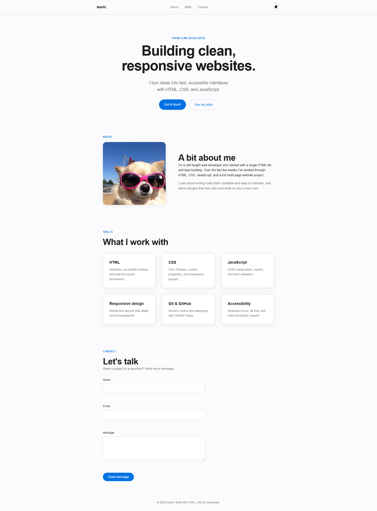

# Advanced Portfolio — CSS Grid, Variables & Animations

Week 5 project: a personal portfolio rebuilt with advanced, modern CSS. The
design is clean and Apple-inspired — an off-white canvas, tightly-tracked
headings, a system-blue accent, rounded cards, and restrained motion.

**Live demo:** _add your GitHub Pages link here after deploying_

---

## Project Overview

The goal was to redesign the portfolio from earlier weeks using advanced CSS
techniques while keeping the code readable and maintainable. It has four
sections — Hero, About, Skills, and Contact — plus a working dark/light theme
toggle and a validated contact form.

## Features

- **CSS Grid** for the main section layouts (About two-column, Skills auto-fit grid)
- **CSS custom properties** for the entire color system and spacing scale
- **Dark / light theme** toggle that flips one class — every color re-themes from variables
- **Animations** — hero fade-in on load, scroll-reveal on sections, card hover lift
- **Mobile-first responsive design** using `clamp()` and a few breakpoints
- **Advanced selectors** — `:focus-visible`, `::after` nav underline, `::before` icon
- **Client-side form validation** with inline error messages
- **Accessibility** — keyboard focus rings, alt text, and `prefers-reduced-motion` support

## Setup Instructions

No build tools or dependencies — it's plain HTML, CSS, and JavaScript.

1. Clone the repo: `git clone <your-repo-url>`
2. Open `index.html` in a browser, **or** run a local server for module scripts:
   ```bash
   python3 -m http.server 8000
   ```
   then visit `http://localhost:8000`.
3. Replace `images/profile.jpg` with your own photo and edit the text in
   `index.html` (name, about, skills).

> Tip: the JS uses ES modules, so opening the file directly with `file://`
> works in most browsers, but a local server is the reliable way to test.

## Code Structure

```
portfolio/
├── index.html            # Semantic markup, BEM class names
├── css/
│   ├── main.css          # Variables, base styles, typography, components
│   ├── layout.css        # CSS Grid structure + responsive breakpoints
│   └── animations.css    # Keyframes, transitions, scroll reveals
├── js/
│   ├── theme-switcher.js # Dark/light toggle
│   └── main.js           # Form validation + scroll reveal
├── images/               # Profile photo
├── screenshots/          # Light and dark previews
└── README.md
```

The CSS is split by responsibility so each file has one clear job, and it's
loaded in order — `main.css` first because it defines the variables the other
two files depend on.

## Technical Details

**BEM methodology.** Classes follow `block__element--modifier`
(e.g. `contact-form__input--error`). This keeps styles flat and predictable —
no deep nesting or specificity wars — and makes it obvious which HTML a rule
targets.

**CSS variables for theming.** All colors live in `:root`. Dark mode is just a
`body.theme-dark` block that overrides those same variables, so no component
rule ever needs to be touched to re-theme the site.

**Layout decisions.** The Skills grid uses
`repeat(auto-fit, minmax(240px, 1fr))`, so the column count adapts to the
viewport with no extra media queries. The About section stacks on mobile and
becomes a fixed-photo / flexible-text two-column grid above 48rem.

**Performance & polish.** Fonts use the native system stack (zero font
downloads). Sizing uses `clamp()` to scale fluidly instead of stacking
breakpoints. Scroll reveals use `IntersectionObserver` (efficient, no scroll
listeners) and unobserve each section after it animates once. Motion is fully
disabled under `prefers-reduced-motion`.

**Maintainability.** Every CSS and JS file is commented to explain *why* each
choice was made, and functions are small and single-purpose.

## Screenshots

| Light | Dark |
|-------|------|
|  |  |

## Testing

- Validated form: empty name, malformed email, and short message each show an
  inline error; a valid submission clears the form and shows a success message.
- Checked responsive behavior at 375px, 768px, and 1200px widths.
- Verified keyboard navigation (visible focus rings) and dark-mode contrast.
